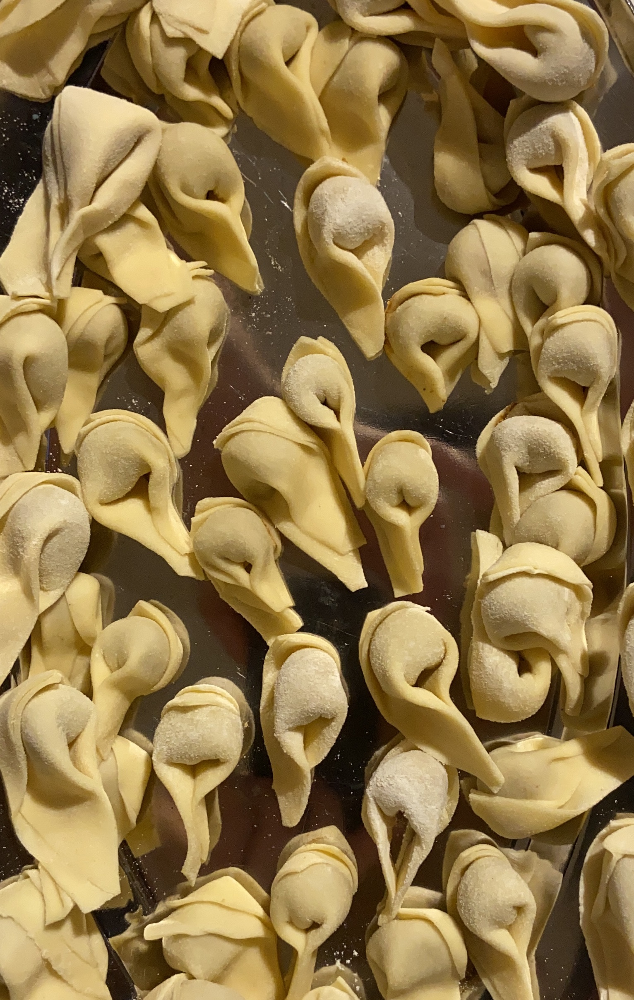

# Rezeptsammlung

## Pizza

### Zutaten
* 270 g Weizenmehl Typ 405 oder 00
* 30 g Hartzweizengries - Semola di grano duro
* 150 ml warmes Wasser (handwarm)
* 4-8 g Olivenöl
* 4-6 g frische Hefe
* 8 g Salz
* 4 g Zucker

### Zubereitung
Die Menge ergibt etwa drei normal große Pizzen, welche je nach Lust und Laune belegt werden können.
150 ml Wasser, Hefe und Zucker miteinander verrühren. Mehl, Salz und Öl mit der aufgelösten Hefe in einer Schüssel zu einem glatten Teig kneten und anschließend ca. eine Stunde abgedeckt warm gehen lassen.
Den Teig in drei gleich große Teile aufteilen und möglichst dünn ausrollen.

Pizza nach Wunsch belegen und in einem vorgeheizten Ofen mit Ober-/Unterhitze auf 240-260° auf unterstem Einschub für ca. 20 Minuten backen.

## Nudelteig ohne Ei (für Tortellinie o.ä.)

### Zutaten
* 150g Mehr Typ 405 oder 00
* 150g Hartzweizengries - Semola di grano duro
* 150g kaltes Wasser
* 4-8g Salz (oder darauf verzichten und lieber beim Kochen etwas mehr)

### Zubereitung
Mehl, Hartweizengries und Wasser miteinander vermengen und gut verkneten.
Den Teig für mindestens ein paar Minuten (30 oder mehr) in Frischaltefolie im Kühlschrank ruhen lassen.
Zum Ausrollen des Teigs ist eine "Nudelmaschine" beinah unerlässlich.

## Naan

### Zutaten
* 150 g Weizenmehl 405
* 2 EL Naturyoghurt
* 50 ml Milch
* 1/2 TL Backpulver
* 1 TL neutrales Öl
* 1/2 TL Zucker
* 1/2 TL Salz

### Zubereitung
Mehl, Zucker, Salz, Backpulver, Yoghurt und Milch verühren und zu einem glatten Teig kneten. Teig in kleine Portionen teilen und möglichst dünn ausrollen.
In einer Pfanne ohne Fett auf großer Hitze von beiden Seiten ausbacken. Wenn Blasen entstehen wenden.

## Ciabatta

### Zutaten
* 300 g Weizenmehl 405
* 150 ml warmes Wasser (handwarm)
* 4-6 g frische Hefe
* 8 g Salz
* 4 g Zucker
* 2-4 g Olivenöl

### Zubereitung
150 ml Wasser, Hefe und Zucker miteinander verrühren. Mehl, Salz und Öl mit der aufgelösten Hefe in einer Schüssel zu einem glatten Teig kneten und anschließend ca. eine Stunde abgedeckt warm gehen lassen.
Den Teig danach auf ein mit Backpapier belegtes Blech geben und nochmals mit etwas Mehr bestäuben.
Ofen mit Ober-/Unterhitze auf 240-260° vorheizen, 10 Minuten backen, anschließend bei 200° 20 Minuten backen.
Eine kleine Schale mit Wasser im Ofen macht das Brot knuspriger.
