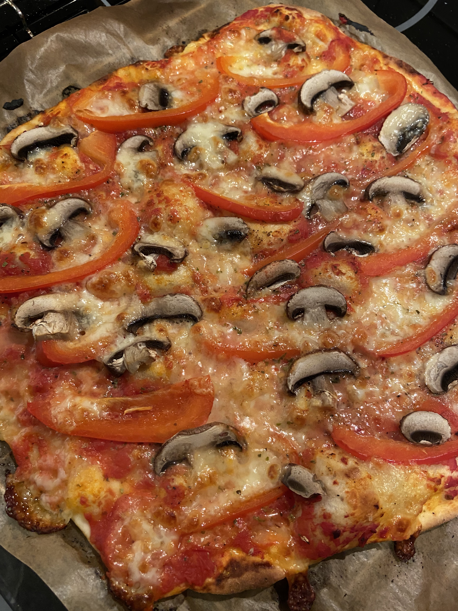

# Rezeptsammlung

## Chicken Korma (mit Hühnchen oder Kartoffeln)

*Nicht vegetarische Variante*

* 500g Hühnchenbrust
* 3 Esslöffel Joghurt
* 1 Esslöffel Ingwer-Knoblauch-Paste
* 1 Teelöffel Salz
* 1 Teelöffel Garam Masala
* 1 Teelöffel Chilipulver

Hühnchen (in mundgerechten Stücken) mit drei Esslöffeln Joghurt, einem Esslöffel Ingwer-Knoblauch-Paste, ca. einem viertel Teelöffel Kurkuma, einem halben Teelöffel Salz, einem Teelöffel Chilipulver und einem Teelöffel Garam Masala in einer Schüssel gut vermischen. Die Mischung anschließend abdecken und mindestens eine Stunde im Kühlschrank zwischenlagern.

*Vegetarische Variante mit Kartoffeln*

6-8 mittelgroße Kartoffeln (festkochend) schälen und in Salzwasser vorkochen.
Wenn gar, im noch warmen Top zum Ausdampfen zur Seite stellen.

*Für die Soße*
* 1 1/2 Esslöffel Öl (oder auch Ghee, oder Butterschmalz)
* 2 mittelgroße Zwiebeln (feine Scheiben geschnitten)
* 2 Kapseln Kardamom
* 6 Mandeln (oder auch Cashewkerne)
* 6 Cashewkerne
* 80-100g griechischer Joghurt (10% Fett)

Das Öl in einer Pfanne erhitzen, die Kardamom-Kapseln mit den Zwiebeln hinzugeben.
Die Mischung unter moderater Hitze so lange anbraten bis die Zwiebeln eine gold-braune Farbe angenommen haben. Die Mandeln und die Cashewkerne hinzugeben.
Die Mischung aus der Pfanne nehmen und abkühlen lassen.
Wenn völlig abgekühlt, die Zwiebel-Nuss-Mischung in einem Mixer mit dem Joghurt zu einer homogenen Masse verarbeiten. Diese Masse anschließend kühl für später aufbewahren.

### Zubereitung

Einen Esslöffel Öl in die Pfanne geben und erhitzen.
Die Gewürze entfalten ihren Duft sowie Geschmack beim Erzhitzen erst richtig, daher:
* 1 Lorbeerblatt
* eine kleine Menge Zimt
* 2-3 Nelken
* 2-3 Kapseln Kardamom
Für ca. eine Minute im heißen Öl braten.

Frische Chili und das Fleisch (bzw. die Kartoffeln) hinzugeben. Das Fleisch sollte 5-6 Minuten im heißen Öl braten. Danach die Soße (Joghurt-Zwiebel-Nuss-Mischung) mit ca. 100 - 150ml Wasser hinzugeben und gut vermischen.
Dann salzen und sowohl gemahlenen Koriander sowie Garam Masala hinzugeben.
Alles gut miteinander vermischen und die Pfanne anschließend auf höchster Stufe erhitzen und das Fleisch mitsamt der Soße zum Kochen bringen. Die Hitze anschließend reduzieren und auf kleiner Flamme simmern lassen. 
Sollte die Soße zu dickflüssig werden, einfach die Masse mit etwas heißem Wasser verdünnen.
Nach gut 20 Minuten sollte das Hühnchen zart und die Soße schön sämig sein.

Dazu passt: Pilau Rice

## Pilau Rice

Für zwei Personen:

* 200g Basmati Reis
* 300-350ml Wasser
* 5g Kreuzkümmel
* 5g Koriander
* Etwas Kurkuma
* 2-4 Gramm Salz
* 10g Ghee oder Butterschmalz, zur Not einen Esslöffel Öl

### Zubereitung
Kreuzkümmel und Koriander im Mörser zu einem möglichst feinen Pulver verarbeiten und mit dem Kurkuma vermischen.

Den Reis mehrfach mit Wasser spülen, so dass die Stärke ausgewaschen wird. Den Reis anschließend abtropfen.
In einem ausreichend großen Topf das Ghee oder Butterschmalz erhitzen und anschließend die Gewürzmischung hinzugeben und unter Rühren etwas anrösten.
Nach etwa 40 Sekunden den abgetropften Reis hinzugeben, mit den Gewürzen vermischen, kurz anbraten und nach weiteren 30 Sekunden das Wasser sowie das Salz hinzugeben und unter gelegentlichem Rühren das Wasser möglichst komplett verkochen lassen.
Ist das Wasser verkocht, den Topf von der Platte nehmen und mit geschlossenem Deckel für ca. 20 Minuten an der Seite ruhen lassen.

## Hascheeknödel (Hackfleischknödel)

### Zutaten

*Für den Teig:* 
* 1Kg mehlig kochende Kartoffeln
* 300g Mehl
* 40g Hartweizengries - Semola di grano duro
* 2 Eigelb
* Muskat
* Salz

*Für die Füllung*
* 500g gemischtes Hackfleisch (halb halb)
* 1 Zwiebel
* 2 Knoblauchzehen
* etwas Öl und/oder Butterschmalz
* Majoran
* Salz
* Pfeffer
* frische Petersilie

### Zubereitung
Die Zwiebel und die Knoblauchzehen schälen, im Öl und/oder Butterschmalz glasig andünsten. Das Hackfleisch zugeben und langsam anbraten.
Mit Salz, Pfeffer und Majoran würzen. Wenn das Hackfleisch gar und krümelig, aber nicht zu trocken ist, die Petersilie fein gehackt zugeben und die Pfanne von der Platte nehmen und abkühlen lassen.

Die Kartoffeln in reichlich Wasser kochen. Wenn gar, die Kartoffel unter kaltem Wasser abschrecken und schälen. Anschließend die noch warmen Kartoffeln pressen oder stampfen, bis eine gleichmäßige, feine Masse entstanden ist. Mit Salz (reichlich) und Muskat würzen, die zwei Eigelb zugeben und mit Mehl und dem Hartweizengries zu einem Teig verkneten.
Den Teig etwas ruhen lassen und zu einer Rolle formen.

Nun einzelne Portionen (walnussgroß) abstechen, zu einer Kugel formen und platt ausdrücken oder walzen und in der hohlen Hand halten, dann in die enstandene Mulde im Teig eine kleine Menge Hackfleisch plazieren und den Teig herum falten, so dass die Füllung umschlossen ist. 

Die Knödel anschließend mit etwas Mehl in der Hand zu einer Kugel formen.

Die Knödel anschließend in leicht siedendem Wasser (darf nicht kochen!) ca. 20 Minuten garen lassen. Die Knödel sind gar, wenn sie an die Oberfläche steigen.

## Pizza

### Zutaten
* 270 g Weizenmehl Typ 405 oder 00
* 30 g Hartweizengries - Semola di grano duro
* 160 ml warmes Wasser (handwarm)
* 4-8 g Olivenöl
* 3-4 g frische Hefe
* 8 g Salz
* 4 g Zucker

### Zubereitung
Die Menge ergibt etwa zwei normal große Pizzen, welche je nach Lust und Laune belegt werden können.
Wasser, Hefe und Zucker miteinander verrühren. Mehl, Salz und Öl mit der aufgelösten Hefe in einer Schüssel zu einem glatten Teig kneten und anschließend ca. eine Stunde abgedeckt warm gehen lassen.
Den Teig in zwei gleich große Teile aufteilen und möglichst dünn ausrollen.

Pizza nach Wunsch belegen und in einem vorgeheizten Ofen mit Ober-/Unterhitze auf 240-260° auf unterstem Einschub für ca. 20 Minuten backen.

## Nudelteig ohne Ei (für Tortellini o.ä.)

### Zutaten
* 150g Mehl Typ 405 oder 00
* 150g Hartweizengries - Semola di grano duro
* 150g kaltes Wasser
* 4-8g Salz (oder darauf verzichten und lieber beim Kochen etwas mehr)

### Zubereitung
Mehl, Hartweizengries und Wasser miteinander vermengen und gut verkneten.
Den Teig für mindestens ein paar Minuten (30 oder mehr) in Frischaltefolie im Kühlschrank ruhen lassen.
Zum Ausrollen des Teigs ist eine "Nudelmaschine" beinah unerlässlich.

## Tandoori Chicken (ohne Tandoori-Ofen)

### Zutaten

* 500-600g Hühnerbrust
* ca. 250g griechischer Yoghurt
* 1 Zehe Knoblauch, gepresst
* Curry-Mischung (Kreuzkümmel, Koriander, Zimt, Kardamom, Bockshornklee, Chili, gemahlener Ingwer, ..., etc.)
* Salz und Pfeffer zum Abschmecken
* den Saft einer Limette/Zitrone
* etwas neutrales Speiseöl (muss nicht)
* etwas Speisestärke (muss nicht)

Yoghurt und Gewürze mit dem Zitronensaft vermischen und abschmecken.
Das Hühnchen säubern und in mundgerechte Stücke zerteilen und in der Marinade mehrere Stunden ruhen lassen.
Die Hähnchenstücke auf Spieße aufziehen und möglichst heiß auf einem Grill (Gasgrill) mit geschlossenem Deckel erhitzen. Die Marinade sollte dabei nicht verbrennen - was sich nicht in Gänze verhindern lässt. Kleine, verbrannte Teile der Fleischstücke lassen sich meist nicht verhindern.

Als Beilage passt Reis sowie Fladenbrot, oder ein einfaches Curry mit Tomaten und Kichererbsen.

Tip: Gewürze leicht anrösten, dann mit einem Mörser fein zerstoßen.

## Naan

### Zutaten
* 150 g Weizenmehl 405
* 2 EL Naturyoghurt
* 50 ml Milch
* 1/2 TL Backpulver
* 1 TL neutrales Öl
* 1/2 TL Zucker
* 1/2 TL Salz

### Zubereitung
Mehl, Zucker, Salz, Backpulver, Yoghurt und Milch verühren und zu einem glatten Teig kneten. Teig in kleine Portionen teilen und möglichst dünn ausrollen.
In einer Pfanne ohne Fett auf großer Hitze von beiden Seiten ausbacken. Wenn Blasen entstehen wenden.

## Ciabatta

### Zutaten
* 300 g Weizenmehl 405
* 150 ml warmes Wasser (handwarm)
* 4-6 g frische Hefe
* 8 g Salz
* 4 g Zucker
* 2-4 g Olivenöl

### Zubereitung
150 ml Wasser, Hefe und Zucker miteinander verrühren. Mehl, Salz und Öl mit der aufgelösten Hefe in einer Schüssel zu einem glatten Teig kneten und anschließend ca. eine Stunde abgedeckt warm gehen lassen.
Den Teig danach auf ein mit Backpapier belegtes Blech geben und nochmals mit etwas Mehr bestäuben.
Ofen mit Ober-/Unterhitze auf 240-260° vorheizen, 10 Minuten backen, anschließend bei 200° 20 Minuten backen.
Eine kleine Schale mit Wasser im Ofen macht das Brot knuspriger.

## Mediterraner Tomate-Gurke-Salat mit roten Zwiebeln

### Zutaten für vier Personen
* eine Salatgurke
* vier reife, aber möglichst feste Tomaten
* zwei kleine rote Zwiebeln
* den Saft einer Zitrone (ca. 30-50ml)
* ebenso viel Olivenöl
* etwas Honig
* Salz
* ein Bund Petersilie
* Majoran
* Thymian

Die Salatgurke schälen und halbieren, mit einem Löffel vom Kerngehäuse befreien und in ca 1-2 cm lange sowie breite Würfel schneiden.
Die Gurkenwürfel in einer Schüssel mit etwas Salz bestreuen und vermengen – dies zieht Wasser aus der Gurke.
Die Tomaten halbieren, vom Kerngehäuse befreien und in kleine Stücke schneiden. Ebenso in einer Schüssel mit etwas Salz bestreuen, so dass auch hier das Wasser aus den Tomaten gesogen wird.
Die beiden Zwiebeln in feine Ringe schneiden und in einer Schüssel mit etwas Salz bestreuen, vermengen und so ca. 20 Minuten stehen lassen.

Aus dem Saft der Zitrone und der gleichen Menge Olivenöl, dem Honig, Majoran und Thymian ein Dressing mischen.
Die Petersilie waschnen und Hacken.
Tomaten, Gurken, Zwiebeln und Petersilie vermischen und das Dressing darüber geben.
